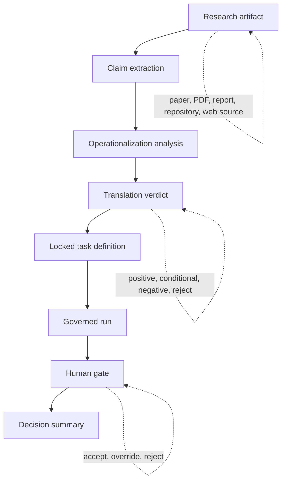

# Research Rationale

**Applied AI Research Translator** exists because research artifacts increasingly move into operational AI decisions faster than institutions can reconstruct the reasoning that carried them there.

A paper, PDF, online report, benchmark note, GitHub repository, or policy publication can contain useful evidence. It can also contain assumptions, scope limits, missing replication, unstable claims, incentive bias, version drift, or deployment conditions that disappear when a team turns the source into a task. The governance problem begins at that conversion point.

This repository treats research translation as a controlled decision process. The system converts source material into falsifiable claims, bounded tasks, schema-validated artifacts, human-gated decisions, and audit-ready summaries. The result is a research-to-decision record that can be reviewed by researchers, governance teams, institutional boards, auditors, and technical implementers.

## Reader Map

| Reader | Primary Question | Recommended Path |
|---|---|---|
| AI governance researcher | How does the system turn research into accountable institutional decisions? | Read this file, then `TRANSLATION-METHOD.md`, `GOVERNANCE-MODEL.md`, and `TRACEABILITY.md`. |
| AI safety researcher | Where are autonomy, overreach, and unsupported operationalization constrained? | Start with the negative translation case, then inspect `tasks.json`, `eval_plan.json`, and `decision_summary.json`. |
| Institutional reviewer | What evidence supports a decision to translate, condition, reject, or defer? | Review `decision_summary.json`, source capture, claim extraction, and human-gate records. |
| Technical implementer | Which artifacts must exist before code execution or model calls begin? | Inspect `schemas/`, `runloop/`, and `examples/runs/`. |
| Archivist or citation reviewer | Why should this repository be treated as research software? | Read the contribution statement, artifact model, and release rationale. |

## Core Thesis

Research translation is a governance control point.

The institutional risk arises when a research artifact becomes an operational premise without a controlled record of how the artifact was interpreted, narrowed, tested, rejected, or approved. Applied AI Research Translator addresses that gap by making each interpretive step explicit before downstream action occurs.



## The Research-to-Deployment Gap

Applied AI research often travels through a compressed path:

```text
Interesting paper → prototype idea → model-assisted task → workflow adoption → institutional reliance
```

That path is convenient. It is also governance-poor. Each arrow hides a decision: which claim was selected, which assumptions were preserved, which constraints were dropped, which failure modes mattered, which reviewer had authority, and which evidence justified movement to the next step.

Applied AI Research Translator replaces that compressed path with a governed path:

```text
Source → claims → tasks → evaluation plan → governed execution → human gate → decision record
```

The system is designed around a practical institutional finding: research does its best work when it informs decisions, and governance does its best work when it records how those decisions were made.

## Why Online Research Requires Governance

Research used in AI workflows now comes from a wide and uneven source surface. Some sources are peer reviewed. Some are preprints. Some are vendor claims. Some are policy guidance. Some are living web pages. Some are repositories with code, examples, and undocumented assumptions.

A governance system must handle this source diversity before operational use.

| Source Type | Why Teams Use It | Main Governance Risk | Required Control |
|---|---|---|---|
| Peer-reviewed paper | Establishes scholarly basis for a method, evaluation, or risk control | Findings may depend on lab context, dataset boundary, population, or benchmark assumption | Extract claims, assumptions, limitations, and operational conditions before task design |
| Preprint | Provides early signal on emerging capability, failure mode, or mitigation | Review status, version drift, and replication status may remain unsettled | Record version, provenance, uncertainty, and review status in the pack |
| PDF report | Supplies board, policy, vendor, or institutional evidence | Narrative claims may combine empirical evidence, interpretation, and recommendation | Separate source claims from operational recommendations |
| Online publication | Identifies emerging patterns, field debate, or implementation insight | Content may change, disappear, or lack stable citation metadata | Capture source text, date, URL, and claim-level evidence |
| GitHub repository | Provides implementation detail, benchmark code, or reproducibility material | Code may diverge from the paper, omit constraints, or carry dependency and license risk | Validate license, dependency surface, reproducibility claim, and execution boundary |
| Vendor publication | Helps teams evaluate tools, platforms, and product categories | Incentives may favor capability claims and downplay failure cases | Label provenance, separate product claims from evidence, require independent review |
| Standards or guidance | Defines governance expectations and institutional duties | Guidance often states what must be governed while leaving evidence design open | Convert requirements into controls, owners, artifacts, and review thresholds |

The source may be useful. The source alone has limited institutional authority. Authority emerges from a governed record: what was extracted, why it was selected, how it was bounded, what evidence was produced, and who approved the result.

## Failure Modes in Ungoverned Research Translation

Ungoverned research translation creates a familiar class of failures. The organization believes it is acting from evidence, while the evidence has already been transformed through informal interpretation.

| Failure Mode | What Happens | Institutional Consequence | Translator Control |
|---|---|---|---|
| Claim overextension | A narrow research finding becomes a broad operational premise | Deployment conditions exceed the evidence base | Require claim-level extraction and scope fields |
| Context collapse | Dataset, population, task setting, or benchmark assumptions vanish during adoption | The implemented task differs from the evaluated condition | Preserve source assumptions in `claims.json` and `eval_plan.json` |
| Authority laundering | A publication is treated as approval for implementation | Research evidence substitutes for institutional authorization | Require translation verdict and human gate |
| Version drift | A web source, repository, or preprint changes after review | Later reviewers cannot reconstruct the source state | Capture source text and version metadata |
| Incentive contamination | Vendor or advocacy material enters the workflow as neutral evidence | Procurement and governance decisions inherit source bias | Label provenance and require independent decision summary |
| Hidden task expansion | A bounded claim becomes an open-ended AI workflow | Autonomy and accountability surface expand silently | Lock task inputs, outputs, constraints, and failure conditions |
| Audit gap | Reviewers see final output without the interpretive chain | Decision basis becomes irreconstructable | Produce deterministic `decision_summary.json` from artifacts |
| Rejection loss | Every research source becomes a candidate for implementation | Governance becomes adoption acceleration | Make negative translation and rejection first-class outcomes |

The most serious failure is rejection loss. A system that translates every source into action has already abandoned governance. A governed translator must preserve the ability to say: this research matters, and the system should still reject operational translation under current constraints.

## Governed Translation as Institutional Infrastructure

The repository treats governance as an execution architecture. Controls appear in files, schemas, run order, validation scripts, and decision artifacts.

| Governance Layer | Question Answered | Artifact Evidence |
|---|---|---|
| Provenance | What source material informed the decision? | `sources/paper_text.txt` and pack metadata |
| Claim extraction | Which claims were selected from the source? | `claims.json` validated against `claims.schema.json` |
| Operationalization | Can the claim become a bounded task? | `tasks.json` and `eval_plan.json` |
| Translation verdict | Should the claim proceed, proceed with conditions, or be rejected? | `decision_summary.json` |
| Execution boundary | What may the model do during a governed run? | `run_input.json`, task constraints, schema contracts |
| Validation | Did the output satisfy the expected structure? | `run_output.schema.json` and validation scripts |
| Human authority | Who accepted, overrode, or rejected the proposed output? | `human_gate.json` and final artifacts |
| Audit reconstruction | Can a reviewer rebuild the decision path later? | Logs, manifests, summaries, and traceability documentation |

This is why the repository is software rather than a framework memo. The governance claim is implemented as artifact discipline.

## Why Schema Validation Matters

Schema validation converts governance language into enforceable contracts. A policy can say that research claims should be traceable, scoped, and reviewed. A schema requires fields that make traceability, scope, and review visible.

| Schema | Governance Function |
|---|---|
| `agent_spec.schema.json` | Defines the permitted role, task boundary, and execution constraints |
| `claims.schema.json` | Requires claims to be structured, source-linked, and reviewable |
| `tasks.schema.json` | Locks task inputs, outputs, constraints, and failure conditions |
| `run_input.schema.json` | Captures the exact input state used in a governed run |
| `run_output.schema.json` | Requires model output to remain structured and machine-checkable |
| `decision_summary.schema.json` | Forces the final decision artifact to record outcome, rationale, and authority |

Schema enforcement gives researchers and reviewers a practical benefit: the system can fail closed. A missing claim field, malformed output, or incomplete decision record becomes a validation problem rather than an interpretive afterthought.

## Why Human-Gated Review Matters

The human gate is the authority boundary. The model may produce candidate evidence. It may produce structured output under a locked task. It may support classification, comparison, or extraction. It cannot authorize its own operational use.

| Decision State | Meaning | Record Required |
|---|---|---|
| Accept | The human reviewer approves the proposed output under stated constraints | Reviewer identity, timestamp, rationale, final artifact |
| Override | The human reviewer replaces or modifies the proposed output | Reviewer rationale, original proposal, revised final artifact |
| Reject | The human reviewer blocks the output from becoming final | Rejection reason, source evidence, unresolved issue |
| Defer | The reviewer holds the decision pending missing evidence | Missing evidence, required follow-up, decision owner |

The human gate prevents a model-produced artifact from becoming institutional judgment through file movement alone. That distinction matters for AI safety, institutional accountability, and audit reconstruction.

## Translation-Positive and Translation-Negative Cases

The repository includes both translation-positive and translation-negative examples because both are required for credible governance.

| Case Type | What It Demonstrates | Governance Value |
|---|---|---|
| Translation-positive | A research claim can become a bounded, schema-validated task | Shows how research can inform controlled operational work |
| Approve with conditions | A task can proceed only with constraints, review, and evidence limits | Preserves use while bounding reliance |
| Translation-negative | A research contribution exceeds the current governance boundary | Shows the system can block unsafe or unsupported translation |
| Reject translation | The source remains analytically useful while operational translation is refused | Protects the difference between learning from research and acting from research |

The negative case has special research value. It shows that the system’s output is constrained by governance criteria rather than by an adoption bias.

## Relation to AI Governance and AI Safety

This project sits at the intersection of applied AI governance, research translation, decision accountability, and human oversight. Its safety contribution is architectural: it constrains how research becomes action.

| Research Area | Repository Contribution |
|---|---|
| AI governance | Defines artifacts, schemas, and review stages for research-informed AI decisions |
| AI safety | Preserves boundaries around autonomy, uncertainty, failure conditions, and human control |
| Responsible AI | Requires provenance, scoped claims, reviewability, and human authorization |
| Decision accountability | Produces reconstructable records of why a system advanced, stalled, or was rejected |
| Institutional audit | Converts interpretive steps into files that can be reviewed after the decision |
| Applied research methods | Supplies a reusable translation model for papers, PDFs, reports, repositories, and online sources |

The repository does one narrow thing: it governs the translation layer between research and institutional action. That layer is often invisible. Here it becomes the primary object of design.

## Boundaries of the Project

This repository is a reference implementation for governed research translation. It is designed to demonstrate artifact discipline, schema enforcement, human-gated review, and audit reconstruction.

It does no independent replication of source papers. It does no automatic truth certification of research findings. It does no live web verification during a run. It does no autonomous deployment. It does no replacement of institutional review boards, legal review, procurement review, security review, or domain expert judgment.

Those boundaries are deliberate. The system governs translation from source to decision artifact. Other institutional controls must still govern the surrounding environment.

## What Counts as Success

A successful governed translation produces a decision record that an external reviewer can inspect without needing to trust the original operator’s memory.

| Success Criterion | Evidence |
|---|---|
| The source is reconstructable | Captured source text and provenance metadata exist |
| Claims are inspectable | Each claim appears in structured form with evidence and scope |
| Tasks are bounded | Inputs, outputs, constraints, and failure conditions are explicit |
| Evaluation is defined before reliance | `eval_plan.json` exists before decision summary generation |
| AI output is intermediate | Candidate and proposed artifacts remain distinct from final output |
| Human authority is recorded | Accept, override, reject, or defer decision is logged |
| Rejection remains available | Translation-negative outcomes are valid system outputs |
| The final decision can be audited | `decision_summary.json` links the artifact chain |

## Research Contribution Statement

Applied AI Research Translator contributes a governed reference model for converting research artifacts into institutional decision records. Its main contribution is the artifact chain: source capture, claim extraction, task bounding, evaluation planning, schema validation, human authorization, and deterministic decision summarization.

The project’s value for the research community is methodological. It gives researchers a concrete object for studying how applied AI findings enter institutional workflows, how translation can fail, how human authority can be preserved, and how decisions can be reconstructed after model-assisted work has occurred.

## Suggested Citation Context

Use this repository when citing research software that demonstrates governed research-to-decision translation, especially in work concerning AI governance, AI safety, responsible AI operations, human oversight, auditability, decision accountability, and institutional review of AI-assisted workflows.

## Author

Mark Julius Banasihan  
AI Governance Specialist | Researcher in AI Safety & Policy  
ORCID: [0009-0001-8121-2878](https://orcid.org/0009-0001-8121-2878)

## License

Apache License 2.0.
