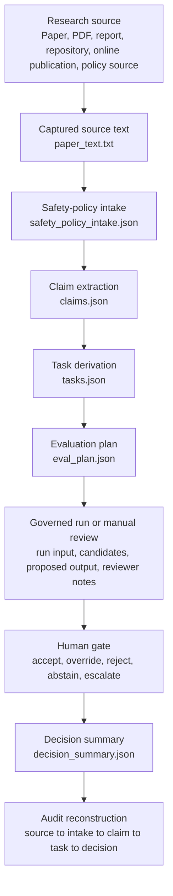

# Traceability

## Source-to-Decision Traceability for Applied AI Research Translation

Applied AI research becomes governable only when the decision path can be reconstructed. This file defines the traceability model for Applied AI Research Translator: how a research source is captured, how AI safety and policy relevance is classified, how claims become bounded tasks, how evaluation and execution artifacts are logged, and how a final human decision can be audited after the fact.

The repository treats traceability as a primary governance property. A reviewer should be able to move in either direction: from a final decision back to the research source, or from a research source forward to the safety-policy intake, claim record, task boundary, evaluation plan, evidence artifacts, human-gate action, and decision summary.

The core traceability claim is direct:

```text
A decision is audit-ready only when its source, interpretation, risk classification, task boundary, evidence, reviewer action, and final rationale can be reconstructed.
```

---

## 1. Traceability Claim

Applied AI Research Translator uses a source-to-decision chain with seven required controls.

| Control | Question Answered | Repository Evidence |
|---|---|---|
| Source provenance | What research material entered the system? | `packs/<pack_id>/sources/paper_text.txt` |
| Safety-policy intake | What evidence type, AI safety domain, autonomy level, risk screen, review authority, and translation boundary were assigned? | `packs/<pack_id>/safety_policy_intake.json` |
| Claim extraction | Which claims were selected for translation? | `packs/<pack_id>/claims.json` |
| Task derivation | Which claim became which bounded task? | `packs/<pack_id>/tasks.json` |
| Evaluation design | What evidence would count as success, failure, abstention, restriction, or rejection? | `packs/<pack_id>/eval_plan.json` |
| Governed execution or review | What did the system or reviewer produce under schema constraints? | `runloop/`, `examples/runs/`, `docs/demo-runs/` |
| Human decision | Who accepted, overrode, rejected, abstained, or escalated the output? | `decision_summary.json`, `human_gate.json` where present |

The central traceability rule is this: every operational decision must be linked to a source claim, and every safety-relevant source must retain its intake classification and translation boundary.

---

## 2. Traceability Chain



This chain makes research translation inspectable. It separates the source text, the risk and policy classification, the interpretation of the source, the operational task, the runtime or review output, and the institutional decision.

---

## 3. Traceability Levels

| Level | Traceability Layer | Required Artifact | Governance Function |
|---|---|---|---|
| T0 | Source capture | `sources/paper_text.txt` | Preserves the source material used for translation |
| T1 | Safety-policy intake | `safety_policy_intake.json` where applicable | Classifies evidence type, safety domain, autonomy relevance, dual-use status, required review, and translation boundary |
| T2 | Claim extraction | `claims.json` | Converts source text into discrete, falsifiable claims |
| T3 | Claim-to-task binding | `tasks.json` | Links a task to a specific claim through `from_claim_id` |
| T4 | Evaluation logic | `eval_plan.json` | Defines what counts as success, failure, uncertainty, abstention, restriction, or rejection |
| T5 | Schema control | `schemas/*.schema.json` | Enforces artifact structure and blocks uncontrolled outputs |
| T6 | Execution or review trace | `runloop/`, `examples/runs/`, `docs/demo-runs/` | Records bounded system behavior or manual review evidence |
| T7 | Human gate | `human_gate.py`, `human_gate.json` where present | Assigns final authority to a human reviewer |
| T8 | Decision artifact | `decision_summary.json` | Records final decision, confidence, rationale, residual risk, and notes |

A complete safety-relevant pack should reach T8. A development pack may stop earlier, but its status should remain visible.

---

## 4. Artifact Dependency Model

| Artifact | Depends On | Produces | Audit Question |
|---|---|---|---|
| `paper_text.txt` | Original research source | Source corpus for extraction | What text supported the translation attempt? |
| `safety_policy_intake.json` | Source material and reviewer classification | Intake verdict and translation boundary | What kind of authority was the source allowed to have before claims became tasks? |
| `claims.json` | `paper_text.txt`, and intake classification where applicable | Claim records with evidence | Which claims were extracted, and what source evidence supports them? |
| `tasks.json` | `claims.json`, intake boundary | Bounded task definitions | Which claim produced the task, and what task boundary was imposed? |
| `eval_plan.json` | `claims.json`, `tasks.json`, intake verdict | Evaluation and review criteria | What would justify acceptance, rejection, override, restriction, or abstention? |
| `run_input.json` | `tasks.json`, example artifacts | Runtime input | What exact input was submitted to the governed run? |
| `candidates.jsonl` | `run_input.json`, runner configuration | Raw model candidate records | What did the AI system produce before validation and review? |
| `proposed.json` | Candidate records and schema validation | Proposed output | What output survived schema checks? |
| `human_gate.json` | `proposed.json`, reviewer judgment | Human decision record | What did the human reviewer authorize, change, reject, abstain from, or escalate? |
| `final.json` | `human_gate.json` | Final authorized output | What output became final after human review? |
| `decision_summary.json` | Source, intake, claims, tasks, evaluation, run artifacts, and human decision | Audit-ready decision record | Can the decision be reconstructed without relying on memory? |

The decision summary is the downstream artifact. It carries authority only because the upstream artifacts preserve provenance, risk classification, claim scope, task boundary, evaluation logic, and human review.

---

## 5. Claim-to-Task Binding

The binding between a research claim and an operational task is the most important traceability relation in the repository. The `tasks.schema.json` file requires each task to include `from_claim_id`. That field prevents tasks from floating free of their evidence base.

| Field | Artifact | Traceability Role |
|---|---|---|
| `claim_id` | `claims.json` | Stable reference for a specific research claim |
| `claim_text` | `claims.json` | Human-readable statement of the claim |
| `evidence` | `claims.json` | Source-linked support for the claim |
| `from_claim_id` | `tasks.json` | Link from task back to the claim |
| `objective` | `tasks.json` | Operational purpose of the task |
| `constraints` | `tasks.json` | Boundary conditions that prevent scope expansion |
| `abstention` | `tasks.json` | Conditions under which the system should halt or decline |
| `evaluation` | `tasks.json` | Evidence requirements for judging output quality |
| `governance` | `tasks.json` | Human review, accountability, and decision requirements |

A task without a source claim becomes an implementation preference. A task with a source claim, bounded objective, abstention rule, evaluation plan, and human gate becomes a governed translation unit.

---

## 6. Safety-Policy Intake Traceability

Safety-policy intake adds a traceability layer before claim extraction. This matters because some sources should never move directly from research text to task design.

| Intake Field Group | Traceability Question | Evidence Use |
|---|---|---|
| `source_status` | What kind of source is this, and how mature is the evidence? | Helps distinguish empirical research, forecasts, scenarios, legal requirements, benchmarks, and implementation evidence |
| `ai_safety_domain` | Which AI safety or policy domain does the source touch? | Routes capability forecasting, misuse, loss of control, compute governance, model-weight security, liability, international governance, and concentration of power |
| `capability_and_autonomy` | Does the source imply advisory use, bounded tool use, delegated tasks, or open-ended agency? | Prevents agentic capability from being normalized as ordinary task support |
| `risk_screen` | Does the source raise dual-use, misuse, oversight failure, or catastrophic-risk concerns? | Supports restriction, human review, policy mapping, or rejection |
| `governance_mapping` | Which decision lever and reviewer authority are implicated? | Assigns research, governance, AI safety, legal, security, or domain review before progression |
| `translation_verdict` | What translation boundary applies? | Determines whether the source proceeds, proceeds with constraints, remains evaluation-only, remains policy-only, is restricted, is rejected, or abstains |

The intake artifact should be traceable both forward and backward. Forward, it constrains claims, tasks, and evaluation. Backward, it explains why a decision summary permitted, limited, or blocked translation.

---

## 7. Decision Pack Traceability Index

| Pack | Current Status | Traceability Coverage | Decision Meaning |
|---|---|---|---|
| `haic_reliance_review_59e257ff` | Translation-positive research pack | Source, claims, tasks, evaluation plan, decision summary | Reliance calibration research can support bounded decision-support task design |
| `measuring_agents_in_production_a98e2ca8` | Translation-positive candidate research pack | Source, claims, tasks, evaluation plan | Production measurement claims can be translated into bounded monitoring tasks |
| `multi_agent_failure_modes_e0228882` | Safety-policy classified translation-negative pack | Source, safety-policy intake, claims, tasks, evaluation plan, decision summary | Multi-agent autonomy exceeds the repository boundary for governed task translation and should remain policy-mapping or rejection evidence |
| `example_paper_001` | Minimal demonstration pack | Agent specification | Demonstrates minimum pack structure |
| `test_paper_agent_translation_d0702c41` | Development test pack | Agent specification, evaluation plan | Supports workflow testing and translation development |

The negative pack is part of the evidence base. It proves that the translator can produce a governed refusal when a research source requires autonomy, coordination, or accountability surfaces that exceed the project boundary.

---

## 8. Demo-Run Traceability Index

The `docs/demo-runs/` directory records locked demonstrations of the runloop under boundary conditions.

| Demo Run | Scenario | Decision | Traceability Finding |
|---|---|---|---|
| `A` | Explicit abstention | `abstain` | The system recorded a low-confidence abstention when the final category was null |
| `B` | Human override | `override` | The human reviewer overrode a system candidate and accepted accountability for reclassification |
| `C` | Swarm redundancy with unanimous abstention | `abstain` | Three independent calls converged on abstention, and the human reviewer accepted abstention as final |

These runs are useful because they show traceability under decision stress. The repository records successful outputs, abstention, and override because those are the cases reviewers will care about most.

---

## 9. Forward Traceability

Forward traceability answers this question: once a research source enters the system, where does its influence appear?

| Step | Forward Link | Example Path |
|---|---|---|
| Source text to intake | `paper_text.txt` supports `safety_policy_intake.json` | `sources/paper_text.txt` → `safety_policy_intake.json` |
| Intake to claim | Intake verdict constrains whether claim extraction may proceed | `safety_policy_intake.json` → `claims.json` |
| Source text to claim | `paper_text.txt` supports `claims[].evidence[]` | `sources/paper_text.txt` → `claims.json` |
| Claim to task | `claims[].claim_id` maps to `tasks[].from_claim_id` | `claims.json` → `tasks.json` |
| Task to evaluation | `tasks[].task_id` maps to evaluation criteria | `tasks.json` → `eval_plan.json` |
| Task to run | Task definition constrains runtime input and output | `tasks.json` → `examples/runs/*.json` |
| Run to decision | Runtime artifacts support human review | `runloop/logs/<run_id>/` → `decision_summary.json` |
| Decision to archive | Decision summary becomes the citable governance record | `decision_summary.json` → README, release, ORCID, Zenodo |

Forward traceability prevents selective use of research. A claim cannot be used informally after entering the system. It must either become a bounded task, receive a conditional verdict, remain evaluation-only, remain policy-mapping-only, be restricted, or be rejected with rationale.

---

## 10. Backward Traceability

Backward traceability answers this question: given a final decision, can a reviewer reconstruct the evidence chain?

| Starting Artifact | Reviewer Action | Expected Upstream Evidence |
|---|---|---|
| `decision_summary.json` | Identify `run_id`, `task_id`, decision, confidence, rationale, and notes | Human decision record and run context |
| `final.json` or proposed output | Check whether output was accepted, overridden, rejected, abstained from, or escalated | Human gate record |
| `run_input.json` | Confirm which input and task were executed | Task definition and schema version |
| `tasks.json` | Resolve `from_claim_id` | Claim record and intake boundary |
| `claims.json` | Inspect claim text, evidence, testability, dependencies | Source text path and extracted quotes |
| `safety_policy_intake.json` | Inspect evidence type, AI safety domain, autonomy relevance, risk screen, required review, and verdict | Source-risk and translation-boundary basis |
| `paper_text.txt` | Re-read the original source passage | Source basis for the translation decision |

Backward traceability is the audit posture of the project. It gives a reviewer a path from final decision back to source evidence and source-risk classification without relying on informal explanation from the builder.

---

## 11. Traceability Checks

A pack is traceable when these checks pass.

| Check | Pass Condition | Failure Signal |
|---|---|---|
| Source check | Source text or excerpt is captured under `sources/` | Claims cannot be tied to a source file |
| Intake check | Safety-policy intake exists and validates when the source touches AI safety or policy | Risk domain, review authority, or translation boundary is missing |
| Claim check | Each claim has evidence, operationalization, testability, dependencies | Claim is descriptive but cannot be tested |
| Task check | Each task has `from_claim_id`, objective, inputs, outputs, constraints, abstention, evaluation, governance | Task is implementation-shaped without source binding |
| Evaluation check | Evaluation criteria specify measurement and decision conditions | Output quality depends on subjective review alone |
| Schema check | Artifacts validate against the relevant schema | Artifact structure changes silently |
| Human-gate check | Final decision includes accept, override, reject, abstain, or escalate | AI output becomes final by default |
| Decision-summary check | Final decision includes confidence and rationale | Decision lacks enough reasoning for review |
| Negative-verdict check | Rejections include boundary rationale | Rejection becomes an undocumented omission |
| Restriction check | Restricted sources name the reason and required reviewer | Sensitive source material enters ordinary translation |

The failure signals are governance findings. They show where a research source lost traceability before it reached a decision artifact.

---

## 12. Decision States and Traceability Meaning

| Decision State | Meaning | Traceability Requirement |
|---|---|---|
| `proceed_to_task_design` | The source contains claims that can become bounded tasks | Claims must link to source evidence and task candidates |
| `approve_with_conditions` | Output may be used under named constraints | Conditions must appear in the decision artifact |
| `evaluation_only` | Source may inform evaluation design without operational execution | Evaluation boundary must be visible |
| `policy_mapping_only` | Source may inform governance reasoning without task execution | Policy boundary and rationale must be recorded |
| `restricted` | Source requires constrained handling | Restriction basis, reviewer authority, and handling conditions must be recorded |
| `accept` | Human reviewer accepts the proposed output | Human gate and final output must agree |
| `override` | Human reviewer changes the proposed output | Original proposal and revised output must both be preserved |
| `reject_translation` | Source should remain analytical evidence without operational task conversion | Rejection rationale must name the boundary failure |
| `abstain` | System or reviewer declines to produce a final substantive classification | Abstention condition must be recorded |
| `escalate` | Reviewer routes decision to stronger authority | Escalation target and unresolved issue must be recorded |

A decision state is traceable when a reviewer can see what happened, why it happened, and which artifact holds the evidence.

---

## 13. Research Source Traceability

Research source types carry different traceability risks. The repository uses source capture, safety-policy intake, and claim extraction to reduce those risks before task design begins.

| Source Type | Traceability Risk | Control in This Repository |
|---|---|---|
| Peer-reviewed paper | Method and dataset assumptions may vanish during operational use | Preserve source text and extract only claims with testable operationalization |
| Preprint | Version, review status, and replication status may remain unsettled | Record source version and require explicit confidence level |
| PDF report | Evidence, institutional position, and recommendation may be blended | Separate claims from rationale and task design |
| Online article | Content may change after review | Capture source text at translation time |
| GitHub repository | Code, license, and documentation may diverge | Treat repository material as source evidence subject to task-bound validation |
| Standards or policy guidance | Requirements may state obligations without implementation evidence | Translate obligations into control fields, evidence fields, and review gates |
| AI safety and policy source | Capability, misuse, autonomy, loss-of-control, legal, compute, model-weight, or systemic-risk concerns may be operationalized too early | Require safety-policy intake before claim extraction and task design |

The translator does not treat source prestige as operational evidence. Each source must pass through the same chain: source capture, intake where needed, claim extraction, task derivation, evaluation, governed run or review, human decision.

---

## 14. Minimal Complete Traceability Record

A minimal complete traceability record contains these artifacts:

```text
packs/<pack_id>/
├── sources/
│   └── paper_text.txt
├── safety_policy_intake.json
├── claims.json
├── tasks.json
├── eval_plan.json
└── decision_summary.json
```

For packs without AI safety or policy relevance, `safety_policy_intake.json` may be omitted, but the omission should be treated as a maturity and scope statement. For safety-relevant packs, intake is part of the minimal record.

For runtime-backed decisions, the record should also include:

```text
runloop/logs/<run_id>/
├── run_input.json
├── candidates.jsonl
├── proposed.json
├── human_gate.json
├── final.json
└── decision_summary.json
```

The pack-level record shows research translation. The run-level record shows execution and decision authorization.

---

## 15. Traceability Coverage Matrix

| Capability | Present in v1.0 | Strengthened in v1.1 | Added in v1.1.1 | Future Work |
|---|---:|---:|---:|---|
| Source capture | Yes | Yes | Yes | Add source hashing and retrieval timestamp fields |
| Safety-policy intake | No | Planned | Yes | Add reviewer qualification, inter-reviewer comparison, and restricted-handling examples |
| Claim extraction schema | Yes | Yes | Yes | Add source-location precision requirements |
| Task derivation schema | Yes | Yes | Yes | Add formal task risk tier |
| Evaluation planning | Yes | Yes | Yes | Add shared evaluation rubric across packs |
| Negative translation | Yes | Yes | Yes | Add more rejected packs from distinct research domains |
| Human gate | Yes | Yes | Yes | Add reviewer identity policy and approval-role taxonomy |
| Runtime logging | Yes | Yes | Yes | Add run manifest schema |
| Decision summary | Yes | Yes | Yes | Add structured uncertainty and residual-risk fields |
| Cross-pack index | Partial | Planned | Partial | Generate repository-level traceability index |
| DOI archival linkage | Planned | Yes | Yes | Link version-specific DOI after each archived release |

This matrix gives future contributors a disciplined expansion path. Each future improvement should increase reconstructability, source control, decision accountability, safety-policy routing, or reviewer usability.

---

## 16. Reviewer Reconstruction Procedure

A reviewer can reconstruct a decision by following this procedure.

1. Open `decision_summary.json` and record `run_id`, `task_id`, decision, confidence, rationale, and notes.
2. Locate the corresponding task in `tasks.json` using `task_id`.
3. Resolve `from_claim_id` from the task back to `claims.json`.
4. Inspect claim evidence, operationalization, testability, dependencies, and failure modes.
5. Open `safety_policy_intake.json` where applicable and inspect source status, risk domain, autonomy relevance, required review, and translation boundary.
6. Open `sources/paper_text.txt` and verify that the cited source material supports the extracted claim.
7. Review `eval_plan.json` to see what evidence would justify acceptance, override, rejection, restriction, or abstention.
8. Inspect run artifacts where available: input, candidates, proposed output, human gate, final output.
9. Compare the final decision summary against upstream artifacts.
10. Record any gap as a traceability defect.

This procedure is intentionally mechanical. A traceable system lets a reviewer audit the decision path without interviewing the builder.

---

## 17. Traceability Defects

| Defect | Description | Governance Consequence |
|---|---|---|
| Orphan source | Source text is absent or uncaptured | Claims cannot be reconstructed |
| Missing intake | Safety-relevant source lacks `safety_policy_intake.json` | Risk domain and translation boundary are invisible |
| Orphan claim | Claim lacks source evidence | Research source cannot support the translation |
| Orphan task | Task lacks `from_claim_id` | Task cannot be tied to research evidence |
| Scope drift | Task objective exceeds the source claim or intake boundary | Research is being used beyond its support |
| Evaluation gap | Evaluation plan lacks acceptance or rejection criteria | Decision depends on ad hoc judgment |
| Missing abstention | Task lacks halt or decline conditions | System is biased toward output production |
| Missing restriction basis | Restricted source lacks a reason and review authority | Sensitive material may be handled as ordinary input |
| Missing human gate | Proposed output becomes final without human decision | Authority boundary is broken |
| Missing override record | Human change overwrites system proposal | Reviewer cannot distinguish model output from human judgment |
| Missing rejection rationale | Translation failure is undocumented | The system loses evidence for governed refusal |
| Missing confidence | Decision lacks uncertainty level | Reviewer cannot weight the decision appropriately |

Traceability defects should be treated as governance defects. They alter the credibility of the decision record.

---

## 18. Institutional Use

Institutional users can adapt this traceability model for research review, AI governance, procurement, safety evaluation, policy translation, or controlled deployment review.

| Institutional Function | How Traceability Helps |
|---|---|
| Research governance | Shows how a research claim was selected, classified, bounded, tested, and accepted or rejected |
| AI safety review | Identifies autonomy, misuse, loss-of-control, escalation, abstention, and human authority boundaries |
| Procurement review | Separates vendor claims from operational evidence and decision approval |
| Audit preparation | Gives reviewers a source-to-decision path without reconstructing context from memory |
| Policy implementation | Converts policy or standards language into evidence fields and control points |
| Risk committee review | Makes uncertainty, confidence, and residual governance risk visible before approval |
| Scholarly review | Helps reviewers inspect whether the repository’s claims match its artifacts |

The repository is designed for applied research contexts where evidence must travel into operational systems without losing provenance or decision accountability.

---

## 19. Release-Level Traceability

For archival releases, traceability extends beyond runtime artifacts into scholarly metadata.

| Release Artifact | Purpose |
|---|---|
| `README.md` | Explains the system and research contribution |
| `RESEARCH-RATIONALE.md` | Defines why governed research translation is needed |
| `TRANSLATION-METHOD.md` | Defines the method for converting research into governed decision artifacts |
| `GOVERNANCE-MODEL.md` | Defines authority boundaries, human gate logic, abstention, restriction, and audit posture |
| `TRACEABILITY.md` | Defines source-to-decision reconstruction |
| `LIMITATIONS.md` | Defines known constraints and excluded claims |
| `CITATION.cff` | Provides machine-readable citation metadata |
| `.zenodo.json` | Provides archival metadata for DOI minting |
| `REFERENCES.md` | Provides the curated bibliography and source basis for external frameworks, standards, and research norms |

The release record should allow ORCID, Zenodo, GitHub, and a human reviewer to converge on the same description of the work.

---

## 20. Current Limits of the Traceability Model

The current repository demonstrates traceability through schemas, packs, demo runs, safety-policy intake, and decision summaries. Several controls remain future work.

| Limit | Practical Effect | Proposed Control |
|---|---|---|
| Source hashing is absent | A reviewer cannot verify source-file immutability across time | Add SHA-256 hash fields for captured source text |
| Source-location precision varies | Evidence may point to quoted text without stable page or section location | Add page, section, paragraph, or line reference requirements |
| Safety-policy intake depends on reviewer judgment | Risk domain and translation boundary can be underclassified | Add reviewer qualification fields, dual review, and inter-reviewer comparison |
| Run manifest schema is informal | Demo manifests exist, but manifest structure lacks root schema enforcement | Add `run_manifest.schema.json` |
| Reviewer identity policy is undeclared | Human gate records can show action without institutional role taxonomy | Add reviewer role, authority basis, and approval scope |
| Cross-pack index is manual | Repository-level traceability requires reading pack by pack | Generate `TRACEABILITY_INDEX.json` |
| Version-specific DOI updates are manual | Citation metadata may lag newly archived releases | Add release checklist item for DOI and CFF update |

These limits do not weaken the core contribution. They define the next layer of audit maturity.

---

## 21. Summary Statement

Traceability is the evidence architecture of Applied AI Research Translator. The repository governs applied AI research translation by preserving the chain from source material to safety-policy intake, claim, task, evaluation, run or review artifact, human decision, and final audit record. That chain is the difference between research-inspired implementation and governed research-to-decision translation.
