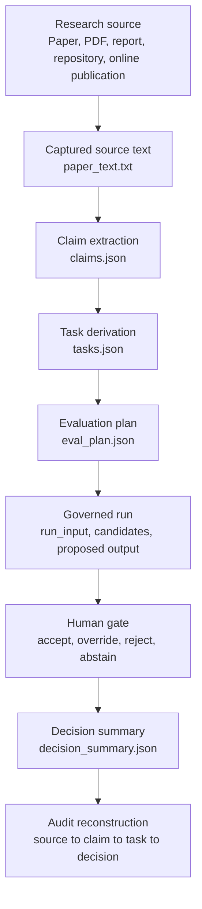

# TRACEABILITY.md

## Source-to-Decision Traceability for Applied AI Research Translation

Applied AI research becomes governable only when the decision path can be reconstructed. This file defines the traceability model for the Applied AI Research Translator: how a research source becomes a claim record, how that claim becomes a bounded task, how execution artifacts are logged, and how a final human decision can be audited after the fact.

The repository treats traceability as a primary governance property. A reviewer should be able to move in either direction: from a final decision back to the research source, or from a research claim forward to the task, evidence, abstention condition, and decision summary that operationalized it.

---

## 1. Traceability Claim

The Applied AI Research Translator uses a source-to-decision chain with six required controls:

| Control | Question Answered | Repository Evidence |
|---|---|---|
| Source provenance | What research material entered the system? | `packs/<pack_id>/sources/paper_text.txt` |
| Claim extraction | Which claims were selected for translation? | `packs/<pack_id>/claims.json` |
| Task derivation | Which claim became which bounded task? | `packs/<pack_id>/tasks.json` |
| Evaluation design | What evidence would count as success, failure, or abstention? | `packs/<pack_id>/eval_plan.json` |
| Governed execution | What did the system produce under schema constraints? | `runloop/`, `examples/runs/`, `docs/demo-runs/` |
| Human decision | Who accepted, overrode, rejected, or abstained from the output? | `decision_summary.json`, `human_gate.json` where present |

The central traceability rule is this: every operational decision must be linked to a source claim and every source claim must retain its translation status.

---

## 2. Traceability Chain



This chain makes research translation inspectable. It separates the source text, the interpretation of the source, the operational task, the runtime output, and the institutional decision.

---

## 3. Traceability Levels

| Level | Traceability Layer | Required Artifact | Governance Function |
|---|---|---|---|
| T0 | Source capture | `sources/paper_text.txt` | Preserves the source material used for translation |
| T1 | Claim extraction | `claims.json` | Converts source text into discrete, falsifiable claims |
| T2 | Claim-to-task binding | `tasks.json` | Links a task to a specific claim through `from_claim_id` |
| T3 | Evaluation logic | `eval_plan.json` | Defines what counts as success, failure, uncertainty, or abstention |
| T4 | Schema control | `schemas/*.schema.json` | Enforces artifact structure and blocks uncontrolled outputs |
| T5 | Execution trace | `runloop/`, `examples/runs/`, `docs/demo-runs/` | Records bounded system behavior under a governed run |
| T6 | Human gate | `human_gate.py`, `human_gate.json` where present | Assigns final authority to a human reviewer |
| T7 | Decision artifact | `decision_summary.json` | Records final decision, confidence, rationale, and notes |

A complete pack should reach T7. A development pack may stop earlier, but its status should remain visible.

---

## 4. Artifact Dependency Model

| Artifact | Depends On | Produces | Audit Question |
|---|---|---|---|
| `paper_text.txt` | Original research source | Source corpus for extraction | What text supported the translation attempt? |
| `claims.json` | `paper_text.txt` | Claim records with evidence | Which claims were extracted, and what source evidence supports them? |
| `tasks.json` | `claims.json` | Bounded task definitions | Which claim produced the task, and what task boundary was imposed? |
| `eval_plan.json` | `claims.json`, `tasks.json` | Evaluation and review criteria | What would justify acceptance, rejection, override, or abstention? |
| `run_input.json` | `tasks.json`, example artifacts | Runtime input | What exact input was submitted to the governed run? |
| `candidates.jsonl` | `run_input.json`, runner configuration | Raw model candidate records | What did the AI system produce before validation and review? |
| `proposed.json` | Candidate records and schema validation | Proposed output | What output survived schema checks? |
| `human_gate.json` | `proposed.json`, reviewer judgment | Human decision record | What did the human reviewer authorize or change? |
| `final.json` | `human_gate.json` | Final authorized output | What output became final after human review? |
| `decision_summary.json` | Run artifacts and human decision | Audit-ready decision record | Can the decision be reconstructed without relying on memory? |

The decision summary is the downstream artifact. It carries authority only because the upstream artifacts preserve provenance, claim scope, task boundary, and human review.

---

## 5. Claim-to-Task Binding

The binding between a research claim and an operational task is the most important traceability relation in the repository. The `tasks.schema.json` file requires each task to include `from_claim_id`. That field prevents tasks from floating free of their evidence base.

| Field | Artifact | Traceability Role |
|---|---|---|
| `claim_id` | `claims.json` | Stable reference for a specific research claim |
| `claim_text` | `claims.json` | Human-readable statement of the claim |
| `evidence` | `claims.json` | Source-linked support for the claim |
| `from_claim_id` | `tasks.json` | Link from task back to the claim |
| `objective` | `tasks.json` | Operational purpose of the task |
| `constraints` | `tasks.json` | Boundary conditions that prevent scope expansion |
| `abstention` | `tasks.json` | Conditions under which the system should halt or decline |
| `evaluation` | `tasks.json` | Evidence requirements for judging output quality |
| `governance` | `tasks.json` | Human review, accountability, and decision requirements |

A task without a source claim becomes an implementation preference. A task with a source claim, bounded objective, abstention rule, and human gate becomes a governed translation unit.

---

## 6. Decision Pack Traceability Index

| Pack | Current Status | Traceability Coverage | Decision Meaning |
|---|---|---|---|
| `haic_reliance_review_59e257ff` | Translation-positive research pack | Source, claims, tasks, evaluation plan, decision summary | Reliance calibration research can support bounded decision-support task design |
| `measuring_agents_in_production_a98e2ca8` | Translation-positive research pack | Source, claims, tasks, evaluation plan | Production measurement claims can be translated into bounded monitoring tasks |
| `multi_agent_failure_modes_e0228882` | Translation-negative research pack | Source, claims, tasks, evaluation plan, decision summary | Multi-agent autonomy exceeds the repository boundary for governed translation |
| `example_paper_001` | Minimal demonstration pack | Agent specification | Demonstrates minimum pack structure |
| `test_paper_agent_translation_d0702c41` | Development test pack | Agent specification, evaluation plan | Supports workflow testing and translation development |

The negative pack is part of the evidence base. It proves that the translator can produce a governed refusal when a research source requires autonomy, coordination, or accountability surfaces that exceed the project boundary.

---

## 7. Demo-Run Traceability Index

The `docs/demo-runs/` directory records locked demonstrations of the runloop under boundary conditions.

| Demo Run | Scenario | Decision | Traceability Finding |
|---|---|---|---|
| `A` | Explicit abstention | `abstain` | The system recorded a low-confidence abstention when the final category was null |
| `B` | Human override | `override` | The human reviewer overrode a system candidate and accepted accountability for reclassification |
| `C` | Swarm redundancy with unanimous abstention | `abstain` | Three independent calls converged on abstention, and the human reviewer accepted abstention as final |

These runs are useful because they show traceability under decision stress. The repository does more than record successful outputs. It records abstention and override, which are the cases a reviewer will care about most.

---

## 8. Forward Traceability

Forward traceability answers this question: once a research source enters the system, where does its influence appear?

| Step | Forward Link | Example Path |
|---|---|---|
| Source text to claim | `paper_text.txt` supports `claims[].evidence[]` | `packs/<pack_id>/sources/paper_text.txt` → `packs/<pack_id>/claims.json` |
| Claim to task | `claims[].claim_id` maps to `tasks[].from_claim_id` | `claims.json` → `tasks.json` |
| Task to evaluation | `tasks[].task_id` maps to evaluation criteria | `tasks.json` → `eval_plan.json` |
| Task to run | Task definition constrains runtime input and output | `tasks.json` → `examples/runs/*.json` |
| Run to decision | Runtime artifacts support human review | `runloop/logs/<run_id>/` → `decision_summary.json` |
| Decision to archive | Decision summary becomes the citable governance record | `decision_summary.json` → README, release, ORCID, Zenodo |

Forward traceability prevents selective use of research. A claim cannot be used informally after entering the system. It must either become a bounded task, receive a conditional verdict, or be rejected with rationale.

---

## 9. Backward Traceability

Backward traceability answers this question: given a final decision, can a reviewer reconstruct the evidence chain?

| Starting Artifact | Reviewer Action | Expected Upstream Evidence |
|---|---|---|
| `decision_summary.json` | Identify `run_id`, `task_id`, decision, confidence, rationale | Human decision record and run context |
| `final.json` or proposed output | Check whether output was accepted, overridden, rejected, or abstained | Human gate record |
| `run_input.json` | Confirm which input and task were executed | Task definition and schema version |
| `tasks.json` | Resolve `from_claim_id` | Claim record |
| `claims.json` | Inspect claim text, evidence, testability, dependencies | Source text path and extracted quotes |
| `paper_text.txt` | Re-read the original source passage | Source basis for the translation decision |

Backward traceability is the audit posture of the project. It gives a reviewer a path from final decision back to source evidence without relying on informal explanation from the developer.

---

## 10. Traceability Checks

A pack is traceable when these checks pass.

| Check | Pass Condition | Failure Signal |
|---|---|---|
| Source check | `source.paper_text_path` points to captured source text | Claims cannot be tied to a source file |
| Claim check | Each claim has evidence, operationalization, testability, dependencies | Claim is descriptive but cannot be tested |
| Task check | Each task has `from_claim_id`, objective, inputs, outputs, constraints, abstention, evaluation, governance | Task is implementation-shaped without source binding |
| Evaluation check | Evaluation criteria specify measurement and decision conditions | Output quality depends on subjective review alone |
| Schema check | All artifacts validate against the relevant schema | Artifact structure changes silently |
| Human-gate check | Final decision includes accept, override, reject, or abstain | AI output becomes final by default |
| Decision-summary check | Final decision includes confidence and at least two rationale statements | Decision lacks enough reasoning for review |
| Negative-verdict check | Rejections include boundary rationale | Rejection becomes an undocumented omission |

The failure signals are governance findings. They show where a research source lost traceability before it reached a decision artifact.

---

## 11. Decision States and Traceability Meaning

| Decision State | Meaning | Traceability Requirement |
|---|---|---|
| `proceed_to_task_design` | The source contains claims that can become bounded tasks | Claims must link to source evidence and task candidates |
| `approve_with_conditions` | Output may be used under named constraints | Conditions must appear in the decision artifact |
| `accept` | Human reviewer accepts the proposed output | Human gate and final output must agree |
| `override` | Human reviewer changes the proposed output | Original proposal and revised output must both be preserved |
| `reject_translation` | Source should remain analytical evidence without operational task conversion | Rejection rationale must name the boundary failure |
| `abstain` | System or reviewer declines to produce a final substantive classification | Abstention condition must be recorded |

A decision state is traceable when a reviewer can see what happened, why it happened, and which artifact holds the evidence.

---

## 12. Research Source Traceability

Research source types carry different traceability risks. The repository uses source capture and claim extraction to reduce those risks before task design begins.

| Source Type | Traceability Risk | Control in This Repository |
|---|---|---|
| Peer-reviewed paper | Method and dataset assumptions may vanish during operational use | Preserve source text and extract only claims with testable operationalization |
| Preprint | Version, review status, and replication status may remain unsettled | Record source version and require explicit confidence level |
| PDF report | Evidence, institutional position, and recommendation may be blended | Separate claims from rationale and task design |
| Online article | Content may change after review | Capture source text at translation time |
| GitHub repository | Code, license, and documentation may diverge | Treat repository material as source evidence subject to task-bound validation |
| Standards or policy guidance | Requirements may state obligations without implementation evidence | Translate obligations into control fields, evidence fields, and review gates |

The translator does not treat source prestige as operational evidence. Each source must pass through the same chain: source capture, claim extraction, task derivation, evaluation, governed run, human decision.

---

## 13. Minimal Complete Traceability Record

A minimal complete traceability record contains these artifacts:

```text
packs/<pack_id>/
├── sources/
│   └── paper_text.txt
├── claims.json
├── tasks.json
├── eval_plan.json
└── decision_summary.json
```

For runtime-backed decisions, the record should also include:

```text
runloop/logs/<run_id>/
├── run_input.json
├── candidates.jsonl
├── proposed.json
├── human_gate.json
├── final.json
└── decision_summary.json
```

The pack-level record shows research translation. The run-level record shows execution and decision authorization.

---

## 14. Traceability Coverage Matrix

| Capability | Present in v1.0 | Strengthened in v1.1 | Future Work |
|---|---:|---:|---|
| Source capture | Yes | Yes | Add source hashing and retrieval timestamp fields |
| Claim extraction schema | Yes | Yes | Add source-location precision requirements |
| Task derivation schema | Yes | Yes | Add formal task risk tier |
| Evaluation planning | Yes | Yes | Add shared evaluation rubric across packs |
| Negative translation | Yes | Yes | Add more rejected packs from distinct research domains |
| Human gate | Yes | Yes | Add reviewer identity policy and approval-role taxonomy |
| Runtime logging | Yes | Yes | Add run manifest schema |
| Decision summary | Yes | Yes | Add structured uncertainty and residual-risk fields |
| Cross-pack index | Partial | Planned | Generate repository-level traceability index |
| DOI archival linkage | Planned | Planned | Add DOI after Zenodo release |

This matrix gives future contributors a disciplined expansion path. Each future improvement should increase reconstructability, source control, decision accountability, or reviewer usability.

---

## 15. Reviewer Reconstruction Procedure

A reviewer can reconstruct a decision by following this procedure.

1. Open `decision_summary.json` and record `run_id`, `task_id`, decision, confidence, rationale, and notes.
2. Locate the corresponding task in `tasks.json` using `task_id`.
3. Resolve `from_claim_id` from the task back to `claims.json`.
4. Inspect claim evidence, operationalization, testability, dependencies, and failure modes.
5. Open `sources/paper_text.txt` and verify that the cited source material supports the extracted claim.
6. Review `eval_plan.json` to see what evidence would justify acceptance, override, rejection, or abstention.
7. Inspect run artifacts where available: input, candidates, proposed output, human gate, final output.
8. Compare the final decision summary against upstream artifacts.
9. Record any gap as a traceability defect.

This procedure is intentionally mechanical. A traceable system lets a reviewer audit the decision path without interviewing the builder.

---

## 16. Traceability Defects

| Defect | Description | Governance Consequence |
|---|---|---|
| Orphan claim | Claim lacks source evidence | Research source cannot support the translation |
| Orphan task | Task lacks `from_claim_id` | Task cannot be tied to research evidence |
| Scope drift | Task objective exceeds the source claim | Research is being used beyond its support |
| Evaluation gap | Evaluation plan lacks acceptance or rejection criteria | Decision depends on ad hoc judgment |
| Missing abstention | Task lacks halt or decline conditions | System is biased toward output production |
| Missing human gate | Proposed output becomes final without human decision | Authority boundary is broken |
| Missing override record | Human change overwrites system proposal | Reviewer cannot distinguish model output from human judgment |
| Missing rejection rationale | Translation failure is undocumented | The system loses evidence for governed refusal |
| Missing confidence | Decision lacks uncertainty level | Reviewer cannot weight the decision appropriately |

Traceability defects should be treated as governance defects. They alter the credibility of the decision record.

---

## 17. Institutional Use

Institutional users can adapt this traceability model for research review, AI governance, procurement, safety evaluation, policy translation, or controlled deployment review.

| Institutional Function | How Traceability Helps |
|---|---|
| Research governance | Shows how a research claim was selected, bounded, tested, and accepted or rejected |
| AI safety review | Identifies autonomy, escalation, abstention, and human authority boundaries |
| Procurement review | Separates vendor claims from operational evidence and decision approval |
| Audit preparation | Gives reviewers a source-to-decision path without reconstructing context from memory |
| Policy implementation | Converts policy or standards language into evidence fields and control points |
| Risk committee review | Makes uncertainty, confidence, and residual governance risk visible before approval |

The repository is designed for applied research contexts where evidence must travel into operational systems without losing provenance or decision accountability.

---

## 18. Release-Level Traceability

For archival releases, traceability extends beyond runtime artifacts into scholarly metadata.

| Release Artifact | Purpose |
|---|---|
| `README.md` | Explains the system and research contribution |
| `RESEARCH-RATIONALE.md` | Defines why governed research translation is needed |
| `TRANSLATION-METHOD.md` | Defines the method for converting research into governed decision artifacts |
| `GOVERNANCE-MODEL.md` | Defines authority boundaries, human gate logic, abstention, and audit posture |
| `TRACEABILITY.md` | Defines source-to-decision reconstruction |
| `LIMITATIONS.md` | Defines known constraints and excluded claims |
| `CITATION.cff` | Provides machine-readable citation metadata |
| `.zenodo.json` | Provides archival metadata for DOI minting |

The release record should allow ORCID, Zenodo, GitHub, and a human reviewer to converge on the same description of the work.

---

## 19. Current Limits of the Traceability Model

The current repository demonstrates traceability through schemas, packs, demo runs, and decision summaries. Several controls remain future work.

| Limit | Practical Effect | Proposed Control |
|---|---|---|
| Source hashing is absent | A reviewer cannot verify source-file immutability across time | Add SHA-256 hash fields for captured source text |
| Source-location precision varies | Evidence may point to quoted text without stable page or section location | Add page, section, paragraph, or line reference requirements |
| Run manifest schema is informal | Demo manifests exist, but manifest structure lacks root schema enforcement | Add `run_manifest.schema.json` |
| Reviewer identity policy is undeclared | Human gate records can show action without institutional role taxonomy | Add reviewer role, authority basis, and approval scope |
| Cross-pack index is manual | Repository-level traceability requires reading pack by pack | Generate `TRACEABILITY_INDEX.json` |
| DOI linkage is pending | Archival citation depends on Zenodo release completion | Add DOI badge and DOI identifier after v1.1 archival release |

These limits do not weaken the core contribution. They define the next layer of audit maturity.

---

## 20. Summary Statement

Traceability is the evidence architecture of the Applied AI Research Translator. The repository governs applied AI research translation by preserving the chain from source material to claim, task, evaluation, run, human decision, and final audit artifact. That chain is the difference between research-inspired implementation and governed research-to-decision translation.
