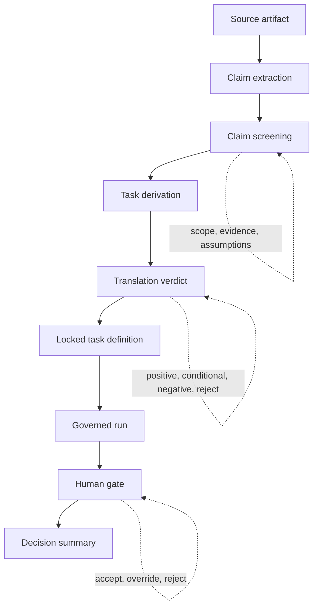

# Translation Method

**Applied AI Research Translator** converts research artifacts into governed decision artifacts. The method exists for cases where a paper, PDF, online publication, technical report, repository, or benchmark claim appears useful, yet the institution still needs to know what claim was selected, what task was derived from it, what assumptions were preserved, what constraints were imposed, and who authorized the result.

The method treats translation as a sequence of controlled reductions. A source becomes claims. Claims become candidate tasks. Candidate tasks receive a translation verdict. Approved tasks enter a bounded run. The run produces structured evidence. A human reviewer accepts, overrides, or rejects the proposed output. The final decision summary records the path.



## Reader Map

| Reader | Main Question | Recommended Path |
|---|---|---|
| AI governance researcher | How does the system convert research into accountable decisions? | Read the full method, then inspect `claims.json`, `tasks.json`, `eval_plan.json`, and `decision_summary.json` across the packs. |
| AI safety researcher | Where does the method constrain autonomous behavior and task expansion? | Start with the translation verdicts and the negative multi-agent pack. |
| Institutional reviewer | What evidence supports a decision to translate, condition, or reject? | Review the artifact chain from source text through final decision summary. |
| Technical implementer | Which artifacts must exist before execution begins? | Inspect schema contracts, validation scripts, and `runloop/README_RUNLOOP.md`. |
| Auditor | Can the decision path be reconstructed after the fact? | Review provenance capture, run manifests, human-gate files, and deterministic summaries. |

## Method Thesis

Research translation requires governance because the act of translating research into action changes the research object.

A publication presents a claim within a scholarly, technical, experimental, or institutional setting. An implementation team needs a task, input, output, evaluation condition, failure rule, owner, and review decision. The translation from claim to task can introduce overreach, remove assumptions, widen the deployment context, or treat scholarly evidence as operational approval.

This method prevents that collapse by separating five functions that are often blended together:

| Function | Question | Artifact |
|---|---|---|
| Source capture | What material informed the translation? | `sources/paper_text.txt` |
| Claim extraction | What exactly did the source claim? | `claims.json` |
| Task derivation | What bounded task can be built from the claim? | `tasks.json` |
| Evaluation design | What evidence would show that the task performed acceptably? | `eval_plan.json` |
| Decision authorization | Who approved, overrode, rejected, or conditioned the result? | `decision_summary.json`, `human_gate.json` |

The method’s contribution is the controlled boundary between research interpretation and operational authority.

## Core Definitions

| Term | Definition | Methodological Role |
|---|---|---|
| Source artifact | The paper, PDF, report, repository, web page, benchmark note, or publication used for translation | Provides the evidence base, provenance record, and claim surface |
| Claim | A discrete proposition extracted from the source that can be scoped, tested, or rejected | Prevents whole-source adoption and forces local interpretation |
| Operationalization | The conversion of a claim into an executable or reviewable task | Exposes where assumptions, metrics, and failure modes enter the workflow |
| Task | A bounded unit of work with inputs, outputs, constraints, abstention conditions, and review points | Defines the execution boundary before model use |
| Translation verdict | The decision that a claim can proceed, proceed with conditions, or be rejected for operational translation | Preserves both adoption and rejection as governed outcomes |
| Governed run | A schema-bound execution that produces logged artifacts and avoids direct deployment authority | Generates evidence under a fixed task boundary |
| Human gate | The review point where a person accepts, overrides, or rejects the proposed output | Assigns decision authority outside the model |
| Decision summary | The final audit artifact that records claim, task, evidence, uncertainty, and authorization | Makes the translation path reconstructable |

## Translation Pipeline

The method has eight stages. Each stage narrows the source material while preserving the information a later reviewer needs to reconstruct the decision.

| Stage | Action | Primary Output | Control Question |
|---|---|---|---|
| 1 | Capture source | `paper_text.txt` | Can the reviewer inspect the same source material used by the translator? |
| 2 | Extract claims | `claims.json` | Which claims were selected, and what evidence supports each one? |
| 3 | Screen claims | annotated claim records | Does each claim have scope, assumptions, testability, and failure conditions? |
| 4 | Derive tasks | `tasks.json` | Can the claim become a bounded task without expanding autonomy or institutional reliance? |
| 5 | Design evaluation | `eval_plan.json` | What evidence would support acceptance, condition, or rejection? |
| 6 | Assign verdict | pack-level decision | Should translation proceed, proceed with conditions, or stop? |
| 7 | Execute bounded run | run artifacts | Did execution remain inside the locked task and schema boundary? |
| 8 | Authorize decision | `decision_summary.json` | What did the human reviewer decide, and on what basis? |

## Stage 1: Source Capture

The method begins by freezing the research material used for translation. Source capture matters because online publications change, PDFs circulate in multiple versions, GitHub repositories evolve, and preprints may shift after review.

The repository stores the working source text inside each pack:

```text
packs/<pack_id>/sources/paper_text.txt
```

Source capture answers three questions:

| Question | Why It Matters |
|---|---|
| What text was used for claim extraction? | Later reviewers need the same source state, especially for web and preprint sources. |
| Which source boundaries were included or excluded? | A PDF, repository, appendix, and benchmark table may carry different claims. |
| What kind of evidence is the source allowed to provide? | A peer-reviewed article, vendor report, and policy memo carry different evidentiary weight. |

The method treats source capture as the first governance artifact. The source provides evidence. It does not authorize implementation.

## Stage 2: Claim Extraction

Claim extraction decomposes the source into discrete propositions. This is the first controlled reduction.

A weak translation process asks: “What is this paper about?”

This method asks a narrower question: “Which claims in this source can be represented, scoped, and tested without losing the conditions that made the claim meaningful?”

A claim record should preserve at least four things:

| Field Type | Purpose |
|---|---|
| Claim text | States the extracted proposition in a bounded form |
| Evidence reference | Links the claim back to source material |
| Scope boundary | Names the setting, population, dataset, task, model class, or deployment condition |
| Failure mode | Names what would make the claim unsafe, unsupported, or unsuitable for translation |

The output lives in:

```text
packs/<pack_id>/claims.json
```

The method rejects whole-paper adoption. A paper can contain a strong evaluation claim, a weaker policy implication, and a speculative deployment recommendation. Claim extraction prevents those from merging into a single adoption argument.

## Stage 3: Claim Screening

Claim screening evaluates whether an extracted claim is a viable candidate for operational translation. Screening happens before task creation because task design can make a weak claim appear more actionable than the source supports.

| Screening Dimension | Question | Translation Implication |
|---|---|---|
| Specificity | Does the claim state a concrete relation, mechanism, behavior, or result? | Vague claims require narrowing before task design. |
| Evidence link | Can the claim be tied to source text or reported evidence? | Unsupported claims should stop or be marked as interpretation. |
| Scope | Does the claim identify the condition under which it holds? | Missing scope creates overextension risk. |
| Testability | Can the claim produce an observable task or evaluation condition? | Untestable claims may remain background knowledge. |
| Failure condition | What would make translation unsafe, invalid, or misleading? | Missing failure conditions weaken governance. |
| Autonomy boundary | Would the claim require autonomous action, coordination, or escalation? | Autonomy expansion triggers heightened review or rejection. |
| Human ownership | Can a human reviewer accept responsibility for the decision? | Unowned decisions should stop. |

Screening produces one of four practical outcomes:

| Outcome | Meaning |
|---|---|
| Retain | The claim can proceed to task derivation. |
| Narrow | The claim may proceed after scope or evidence boundaries are tightened. |
| Hold | The claim is useful background material, with insufficient basis for task translation. |
| Reject | The claim exceeds the system boundary or lacks enough evidence for operational use. |

## Stage 4: Task Derivation

Task derivation converts a screened claim into a bounded operational task. This is the most consequential step in the method because it determines what the system will allow the model to do.

A valid task must define the following elements:

| Task Element | Purpose |
|---|---|
| Task ID | Gives the task a stable reference for traceability |
| Inputs | Specifies what the system may inspect |
| Outputs | Specifies what the system may produce |
| Constraints | Limits the task boundary before execution |
| Metrics | Defines how outputs will be judged |
| Abstention conditions | Specifies when the system should stop or decline |
| Human gate point | Names where human authorization is required |
| Evidence linkage | Connects the task back to the source claim |

The output lives in:

```text
packs/<pack_id>/tasks.json
```

Task derivation follows one central rule: the task must be smaller than the claim. A research claim often has broader implications than the system should operationalize. The task selects a bounded portion that can be run, reviewed, and reconstructed.

## Stage 5: Evaluation Plan

The evaluation plan defines what would count as sufficient evidence for a task to proceed. This prevents the system from treating model output as self-validating.

The output lives in:

```text
packs/<pack_id>/eval_plan.json
```

A strong evaluation plan should identify:

| Evaluation Component | Governance Function |
|---|---|
| Success criteria | Defines what acceptable output means for the bounded task |
| Failure criteria | Defines when the task fails or requires rejection |
| Abstention triggers | Defines conditions under which the system should withhold output |
| Human review criteria | Defines what the reviewer must inspect before approval |
| Evidence requirements | Defines what artifacts must exist before a decision can be recorded |
| Residual uncertainty | Names what the evaluation cannot settle |

The method treats evaluation design as a decision artifact. A task without evaluation criteria is an ungoverned prompt.

## Stage 6: Translation Verdict

The translation verdict determines whether the source claim can enter a governed run. It is the method’s main control point.

| Verdict | Meaning | Typical Use |
|---|---|---|
| `translation_positive` | The claim can become a bounded task with defined evidence and review conditions | Reliance calibration, workflow monitoring, classification, discrepancy review |
| `translation_positive_with_conditions` | The claim can proceed only under additional constraints | Higher-risk review, missing replication, narrow source basis, elevated uncertainty |
| `translation_negative` | The claim remains relevant to research, while operational translation exceeds the current system boundary | Autonomous coordination, unbounded agentic behavior, unsupported generalization |
| `reject_translation` | The source or claim should stop as an operational pathway | Source weakness, missing evidence, unacceptable autonomy, irreconstructable task boundary |
| `defer_translation` | The claim needs additional evidence, source review, or methodological clarification | Version ambiguity, unclear benchmark scope, missing implementation details |

The method preserves rejection as a successful governance outcome. A rejected translation means the system identified a boundary and recorded the reason.

## Stage 7: Governed Execution

Governed execution happens only after task boundaries and evaluation criteria are fixed. The runloop uses locked inputs, schema-bound outputs, artifact logging, and a human gate.

The execution layer is organized under:

```text
runloop/
```

A governed run should produce an artifact trail like this:

```text
run_input.json
candidate outputs
proposed.json
human_gate.json
final.json
decision_summary.json
```

The execution model separates candidate generation from authorization.

| Run Artifact | Role in the Method |
|---|---|
| `run_input.json` | Captures the specific inputs used for execution |
| Candidate outputs | Preserve raw model-generated material for inspection |
| `proposed.json` | Records schema-valid proposed output |
| `human_gate.json` | Records accept, override, or reject decision |
| `final.json` | Stores the human-authorized output |
| `decision_summary.json` | Records the final decision path |

The model may produce candidate evidence. It cannot promote its own output into a final institutional decision.

## Stage 8: Human Gate

The human gate is the authorization point. It records whether a reviewer accepts, overrides, or rejects the proposed output.

| Gate Action | Meaning | Decision Record Requirement |
|---|---|---|
| Accept | The reviewer approves the proposed output under the task boundary | Reviewer identity, timestamp, rationale, accepted artifact |
| Override | The reviewer modifies or replaces the proposed output | Reviewer identity, override rationale, final artifact |
| Reject | The reviewer withholds authorization | Reviewer identity, rejection rationale, risk or evidence basis |

The human gate exists because institutional accountability cannot be delegated to a model output. The decision record must show who carried authority at the point where evidence became action.

## Stage 9: Decision Summary

The decision summary is the final audit artifact. It records the source, claim, task, evidence, verdict, human decision, and residual uncertainty.

The output lives in:

```text
packs/<pack_id>/decision_summary.json
```

or, for runloop-generated demonstrations:

```text
docs/demo-runs/<run_id>/decision_summary.json
```

A decision summary should answer:

| Question | Expected Evidence |
|---|---|
| Which source informed the decision? | Source path, captured text, or citation metadata |
| Which claim was translated? | Claim ID and claim text |
| What task was derived? | Task ID and bounded task definition |
| What evidence was produced? | Run artifacts, evaluation result, validation status |
| What did the human reviewer decide? | Accept, override, reject, or conditional approval |
| What remains unresolved? | Stated uncertainty, limitations, or deferred review item |

The decision summary is deliberately structured. It should read as an audit record, not as a persuasive essay.

## Artifact Chain

The method’s integrity depends on the complete artifact chain.

```text
Source material
  → claims.json
  → tasks.json
  → eval_plan.json
  → run_input.json
  → proposed.json
  → human_gate.json
  → final.json
  → decision_summary.json
```

| Link | Failure Prevented |
|---|---|
| Source → claims | Prevents unsupported paraphrase and whole-source adoption |
| Claims → tasks | Prevents broad claims from becoming unbounded work |
| Tasks → eval plan | Prevents execution without evidence criteria |
| Eval plan → run input | Prevents input drift and unrecorded task expansion |
| Run input → proposed output | Preserves the model evidence trail |
| Proposed output → human gate | Prevents raw model output from becoming final authority |
| Human gate → final output | Assigns authorization to a reviewer |
| Final output → decision summary | Makes the full path reconstructable |

## Translation Criteria

A research claim should proceed only when the following criteria are satisfied.

| Criterion | Pass Condition | Fail Condition |
|---|---|---|
| Provenance | Source material is captured and reviewable | Source state cannot be reconstructed |
| Claim clarity | Claim is discrete, scoped, and linked to evidence | Claim is broad, ambiguous, or unsupported |
| Operational boundedness | Task has fixed inputs, outputs, constraints, and review points | Task requires open-ended autonomy or undefined downstream action |
| Evaluation basis | Evaluation plan defines success, failure, and abstention | Output quality would be judged informally after execution |
| Schema compatibility | Artifacts can be validated against repository schemas | Required fields or artifact types are absent |
| Human ownership | Reviewer authority is explicit | Decision responsibility is diffuse or implied |
| Audit trail | Artifact sequence can be reconstructed | Final result lacks source-to-decision traceability |
| Residual risk | Uncertainty is recorded in the decision artifact | Uncertainty is hidden in prose or omitted |

## Negative Translation Logic

Negative translation is part of the method. A research artifact can be valuable while still unsuitable for operational translation.

A negative verdict is appropriate when one or more conditions hold:

| Condition | Reason for Rejection or Deferral |
|---|---|
| Autonomous coordination required | The task requires agents to plan, coordinate, escalate, or act beyond a bounded review surface |
| Source assumptions cannot be preserved | The deployment setting differs materially from the research condition |
| Evidence basis is too thin | The source provides insufficient support for the derived task |
| Human review cannot inspect the output adequately | The reviewer lacks a clear basis for acceptance or override |
| Audit chain breaks | The decision cannot be reconstructed from artifacts |
| Task expands during execution | The system would need to change scope after seeing model output |
| Failure conditions are undefined | The system lacks a principled stopping rule |

The negative multi-agent pack illustrates this principle. The research contribution may be important, yet translation may still fail because autonomous multi-agent behavior creates an accountability surface that the current runloop should not absorb.

## Method Applied to Example Packs

| Pack | Source Question | Method Outcome | Governance Reason |
|---|---|---|---|
| `haic_reliance_review_59e257ff` | Can human-AI reliance be assessed through structured review behavior? | Translation-positive | Reliance can be instrumented through accept, override, and confidence-stratified review signals |
| `measuring_agents_in_production_a98e2ca8` | Can production agent behavior be measured through workflow-level monitoring? | Translation-positive | Monitoring can be bounded through metrics, drift detection, and reviewable evidence artifacts |
| `multi_agent_failure_modes_e0228882` | Can autonomous multi-agent failure-mode research become a bounded task? | Translation-negative | The claim points toward coordination behavior that exceeds the bounded, reviewable runloop surface |
| `t_c02` | Can operational triage proceed under a fixed taxonomy and human gate? | Approve with conditions | Classification stays within a constrained input-output format and requires review |
| `t_c04` | Can document discrepancy review proceed under bounded comparison logic? | Approve with conditions | Output remains inspectable and final authorization stays with the reviewer |

## Method Boundaries

The method supports governed translation. It does not claim to solve every research or deployment problem.

| Boundary | Meaning |
|---|---|
| No autonomous deployment authority | The system does not execute downstream institutional actions. |
| No automatic proof of source validity | A captured paper or report still requires scholarly and technical review. |
| No replacement for domain expertise | The method structures evidence; it does not supply subject-matter authority by itself. |
| No universal benchmark claim | Example packs demonstrate method behavior, not cross-domain performance guarantees. |
| No hidden model authorization | Model output remains candidate evidence until the human gate records a decision. |

These boundaries strengthen the method because they make the claim auditable. The system governs the translation path. It does not pretend that translation alone establishes truth, safety, or deployability.

## Review Protocol

A reviewer can evaluate a pack by following this sequence:

| Step | Review Action | File |
|---|---|---|
| 1 | Inspect source material | `sources/paper_text.txt` |
| 2 | Compare extracted claims against source material | `claims.json` |
| 3 | Check whether each task preserves claim scope | `tasks.json` |
| 4 | Evaluate success, failure, and abstention criteria | `eval_plan.json` |
| 5 | Inspect translation verdict and rationale | `decision_summary.json` |
| 6 | For executed runs, inspect run input and proposed output | `run_input.json`, `proposed.json` |
| 7 | Inspect human gate decision | `human_gate.json` |
| 8 | Reconstruct final authorization path | `final.json`, `decision_summary.json` |

A pack passes review when the reviewer can move from source material to final decision without relying on unstated assumptions.

## Research Use

Researchers can use this method to study several questions in applied AI governance and AI safety:

| Research Question | Repository Surface |
|---|---|
| How should research findings be converted into bounded operational tasks? | `claims.json`, `tasks.json`, `TRANSLATION-METHOD.md` |
| When should translation stop? | Negative translation packs and decision summaries |
| What artifacts are required for audit reconstruction? | `TRACEABILITY.md`, run manifests, decision summaries |
| How can human oversight be represented as a structured decision record? | `human_gate.py`, `human_gate.json`, final artifacts |
| How should schema validation function as a governance control? | `schemas/`, validation scripts |
| How can institutions use AI output as evidence while preserving human authority? | Governed runloop and deterministic decision summary |

## Implementation Standard

A new translation pack should meet this minimum standard before release:

```text
packs/<pack_id>/
├── agent_spec.json
├── claims.json
├── tasks.json
├── eval_plan.json
├── decision_summary.json
└── sources/
    └── paper_text.txt
```

Minimum acceptance criteria:

| Requirement | Acceptance Standard |
|---|---|
| Source preserved | Source material used for extraction appears in `sources/`. |
| Claims extracted | Claims are discrete and linked to evidence. |
| Tasks bounded | Inputs, outputs, constraints, and review points are explicit. |
| Evaluation stated | Success, failure, and abstention conditions are defined. |
| Verdict recorded | Translation status and rationale are present. |
| Human decision visible | Final authorization, override, rejection, or condition is recorded. |
| Schema validation complete | Required files validate against the relevant schemas. |

## Versioning Implications

Translation artifacts should be versioned because the source, model behavior, schemas, and institutional standards may change.

| Versioned Object | Why It Requires Versioning |
|---|---|
| Source artifact | Web pages, repositories, reports, and preprints can change after review |
| Claims | Later reviewers may extract different claims from the same source |
| Tasks | Task boundaries may tighten as risks become clearer |
| Schemas | Governance contracts may evolve as required evidence changes |
| Run artifacts | Model output may vary across model versions and execution settings |
| Decision summaries | Institutional approvals may expire, narrow, or be superseded |

A release should identify which translation method, schema set, and pack state were used.

## Method Claim

The Applied AI Research Translator method advances one claim: research-to-decision translation can be governed when the repository treats interpretation, task design, model execution, human authorization, and audit reconstruction as separate artifacts.

That separation is the method.
